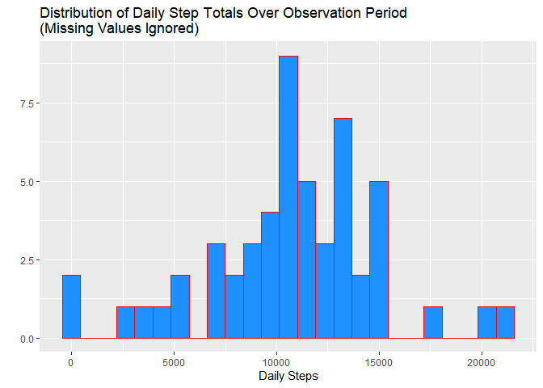
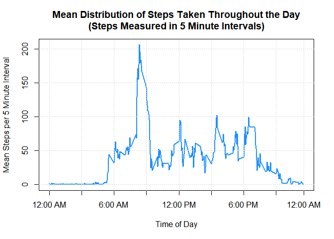
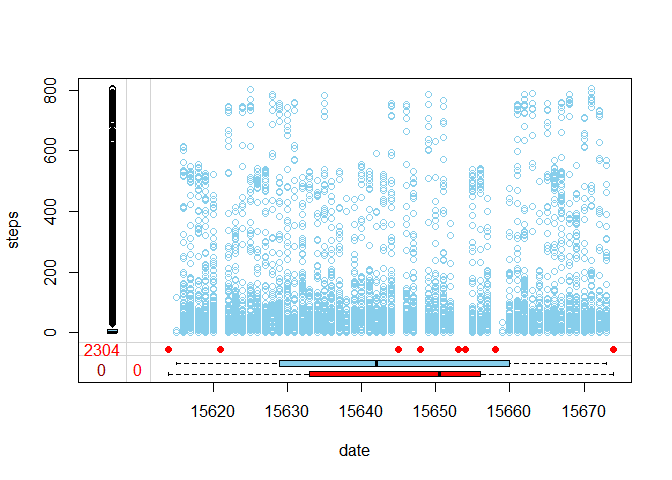
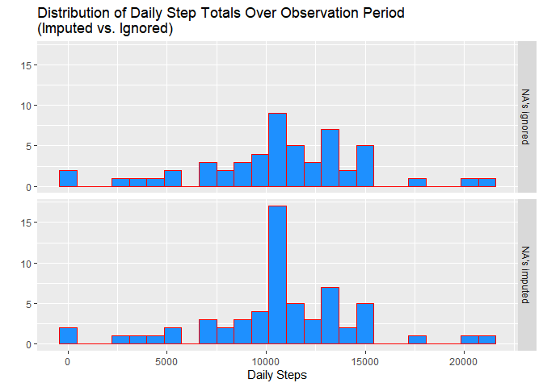
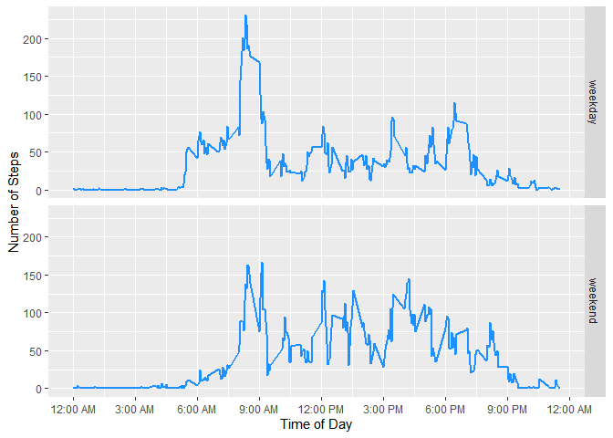

```r
## load required libraries
library(ggplot2)
library(mice)
library(VIM)
```

## 1. Loading and preprocessing the data


```r
## download dataset
fileURL <-
	"https://d396qusza40orc.cloudfront.net/repdata%2Fdata%2Factivity.zip"

if (!file.exists("activity.csv")) {
	download.file(fileURL, "activity.zip")
	unzip("activity.zip")
}

## load dataset into R dataframe
df <- read.csv(
	"activity.csv",
	header = TRUE,
	strip.white = TRUE,
	blank.lines.skip = TRUE,
	quote = "\"",
	row.names = NULL,
	stringsAsFactors = FALSE,
	colClasses = c(date = "Date")
)

## display dataset characteristics
dim(df)
```

```
## [1] 17568     3
```

```r
str(df)
```

```
## 'data.frame':	17568 obs. of  3 variables:
##  $ steps   : int  NA NA NA NA NA NA NA NA NA NA ...
##  $ date    : Date, format: "2012-10-01" "2012-10-01" "2012-10-01" "2012-10-01" ...
##  $ interval: int  0 5 10 15 20 25 30 35 40 45 ...
```

## 2. What is mean total number of steps taken per day?


```r
## aggregate steps by day
total_by_day <-
	aggregate(x = df$steps,
			  by = list(df$date),
			  FUN = "sum")
names(total_by_day) <- c("date", "steps")

## compute mean & median
steps_mean <- mean(total_by_day$steps, na.rm = TRUE)
steps_median <- median(total_by_day$steps, na.rm = TRUE)

## plot histogram of daily step count distribution
ggplot(total_by_day, aes(x = steps)) +
	geom_histogram(fill = "dodgerblue", color = "red", bins = 25) +
	xlab("Daily Steps") +
	ylab("") + ggtitle("Distribution of Daily Step Totals Over Observation Period\n(Missing Values Ignored)")
```

```
## Warning: Removed 8 rows containing non-finite values (stat_bin).
```

<!-- -->


*The mean daily steps for the observation period was `10,766.19`. The median of daily steps was `10,765`.*


## 3. What is the average daily activity pattern?

```r
## compute the mean step count by interval
total_by_interval <-
	aggregate(df$steps, by = list(df$interval), na.rm = TRUE, mean)
names(total_by_interval) <- c("interval", "steps")

## plot the mean step count by interval
plot(
	total_by_interval$interval,
	total_by_interval$steps,
	type = "l",
	col = "dodgerblue",
	lwd = 2,
	pch = 19,
	xaxt = "n",
	xlab = "Time of Day",
	ylab = "Mean Steps per 5 Minute Interval",
	main = "Mean Distribution of Steps Taken Throughout the Day\n(Steps Measured in 5 Minute Intervals)"
)

## I chose to convert the interval numbers to hourly time rather than forcing
## the reader to work it out for themselves
axis(
	1,
	at = c(0, 300, 600, 900, 1200, 1500, 1800, 2100, 2355),
	labels = c(
		"12:00 AM",
		"3:00 AM",
		"6:00 AM",
		"9:00 AM",
		"12:00 PM",
		"3:00 PM",
		"6:00 PM",
		"9:00 PM",
		"12:00 AM"
	)
)

abline(
	h = c(0, 50, 100, 150, 200),
	v = c(0, 300, 600, 900, 1200, 1500, 1800, 2100, 2355),
	col = "lightgray",
	lty = 3
)
```

<!-- -->


```r
## determine the interval with the largest mean step count
## compute the time of day based on that interval number
max_interval <-
	total_by_interval[order(total_by_interval$steps,
							total_by_interval$interval,
							decreasing = TRUE), ][1, 1]
max_steps_at_interval <-
	total_by_interval[order(total_by_interval$steps,
							total_by_interval$interval,
							decreasing = TRUE), ][1, 2]
if (max_interval < 1200) {
	max_time <-
		paste(substr(as.POSIXct(
			sprintf("%04.0f", max_interval), format = "%H%M"
		), 12, 16), "AM")
} else {
	max_time <-
		paste(substr(as.POSIXct(
			sprintf("%04.0f", max_interval - 1200), format = "%H%M"
		), 12, 16), "PM")
}
```
*On average over the observation period, the most steps, `206`, were taken during the five minute period beginning at `08:35 AM` each day.*


## 4. Imputing missing values


```r
## compute total number of rows in the dataframe, the number of missing values and percentage
num_rows <- nrow(df)
num_NA <- sum(is.na(df$steps))
pct_NA <- (num_NA / num_rows) * 100
```
The source dataset contains a total of `17,568` observations. Of those, `2,304` observations contain missing (**NA**) values or `13.11%` of the total. As shown in the graphic below, all **NA** values appear in the `steps` variable:


```r
## use plotting functions from the mice & VIM libraries to visualize missing values
md.pattern(df, plot = TRUE)
```

<!-- -->

```r
marginplot(df[, c("date", "steps")])
```

<!-- -->

As the chart above illustrates, the occurence of the `2,304` missing values were limited to eight specific days within the observation period (`24` hours x `60` minutes ÷ `5` minute intervals = `288` intervals per day x `8` days = `2,304` total missing values) In other words, on the days when measurements were taken, they were 100% complete and vice-versa.

For this analysis, I've chosen to impute missing values by taking the mean step values computed for each five minute interval (computed in Step 3 above). This approach seems more reasonable than simply dropping the observations with missing values.  Because of the frequency of the data collection (5 minute intervals), using the interval mean may be as accurate as applying more advanced regression or means matching methodologies.


```r
## replace missing values with the mean step values from above (computed by 
## ignoring missing values
NA_df <- subset(df, is.na(df$steps))
noNAs_df <- na.omit(df, cols = "steps")
for (i in 1:nrow(NA_df))
	NA_df$steps[i] <-
	as.integer(round(total_by_interval[match(NA_df$interval[i], total_by_interval$interval), 2], 0))
imputed_df <- rbind(noNAs_df, NA_df)
sum(is.na(imputed_df))
```

```
## [1] 0
```

*All missing values have been accounted for.*


```r
## plot histograms in two-panels to illustrate the distribution of daily step
## totals when missing values are ignored versus imputed
imputed_total_by_day <-
	aggregate(x = imputed_df$steps,
			  by = list(imputed_df$date),
			  FUN = "sum")
names(imputed_total_by_day) <- c("date", "steps")
imputed_total_by_day <-
	imputed_total_by_day[order(imputed_total_by_day$steps, imputed_total_by_day$date),]
imputed_total_by_day$source <- "NA's imputed"

imputed_steps_mean <- mean(imputed_total_by_day$steps)
imputed_steps_median <-
	median(imputed_total_by_day$steps)

total_by_day$source <- "NA's ignored"
grouped_totals <- rbind(imputed_total_by_day, total_by_day)

ggplot(grouped_totals, aes(x = steps)) +
	geom_histogram(fill = "dodgerblue", color = "red", bins = 25) +
	facet_grid(source ~ .) +
	xlab("Daily Steps") +
	ylab("") + ggtitle("Distribution of Daily Step Totals Over Observation Period\n(Imputed vs. Ignored)")
```

```
## Warning: Removed 8 rows containing non-finite values (stat_bin).
```

<!-- -->

*The mean daily steps for the observation period was `10,766`. The median of daily steps was `10,762`.*


| Data Type | Mean | Median |
| :------- | :------ | :---- |
| NA's Ignored | 10,766 | 10,765 |
| NA's Imputed | 10,766 | 10,762 |

As mentioned above, there were eight days of the sixty-one day observation period when step counts weren't collected. As part of this analysis, the missing values for those missing days were imputed using the mean step counts from the other fifty-three days where counts were 100% collected. This means there is little likelyhood of there being large variations in the mean and median of the imputed values versus the mean and median of the actual values. As the table above confirms, there is no difference in mean and only a small difference in median.

## 5. Are there differences in activity patterns between weekdays and weekends?


```r
## make a copy of the imputed dataframe
day_of_week_df <- data.frame(imputed_df)

## assign the day type identifier
day_of_week_df$day_type <- ""
for (i in 1:nrow(day_of_week_df))
	if (weekdays(day_of_week_df$date[i]) %in% c("Monday", "Tuesday", "Wednesday", "Thursday", "Friday")) {
		day_of_week_df$day_type[i] <- "weekday"
	} else {
		day_of_week_df$day_type[i] <- "weekend"
	}

## compute the mean by interval and day type
day_type_by_interval <-
	aggregate(
		day_of_week_df$steps,
		by = list(day_of_week_df$day_type, day_of_week_df$interval),
		mean
	)
names(day_type_by_interval) <- c("day_type", "interval", "steps")

## compute the sum by date and day type
day_by_day_type <-
	aggregate(day_of_week_df$steps,
			  by = list(day_of_week_df$day_type, day_of_week_df$date), sum)
names(day_by_day_type) <- c("day_type", "date", "steps")

## split the dataframe by day type
day_type <-
	split(day_by_day_type, day_by_day_type$day_type)

## compute the mean & median of steps each day by day type
weekday_steps_mean <- mean(day_type$weekday$steps)
weekday_steps_median <- median(day_type$weekday$steps)
weekend_steps_mean <- mean(day_type$weekend$steps)
weekend_steps_median <- median(day_type$weekend$steps)

## plot the mean steps by interval by day type
## Note: I chose to convert the interval numbers to hourly time rather than
## forcingthe reader to work it out for themselves
ggplot(day_type_by_interval, aes(x = interval, y = steps)) +
	geom_line(lwd = 1, color = "dodgerblue") +
	facet_grid(day_type ~ .) +
	scale_x_continuous(
		breaks = c(0, 300, 600, 900, 1200, 1500, 1800, 2100, 2400),
		labels = c(
			"12:00 AM",
			"3:00 AM",
			"6:00 AM",
			"9:00 AM",
			"12:00 PM",
			"3:00 PM",
			"6:00 PM",
			"9:00 PM",
			"12:00 AM"
		)
	) +
	xlab("Time of Day") + ylab("Number of Steps")
```

<!-- -->


| Day Type | Mean | Median |
| :------- | :------ | :---- |
| Weekday  | 10,255 | 10,762 |
| Weekend  | 12,201 | 11,646 |


```r
rm(list = ls())
```
